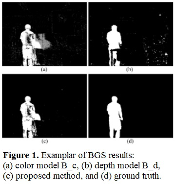
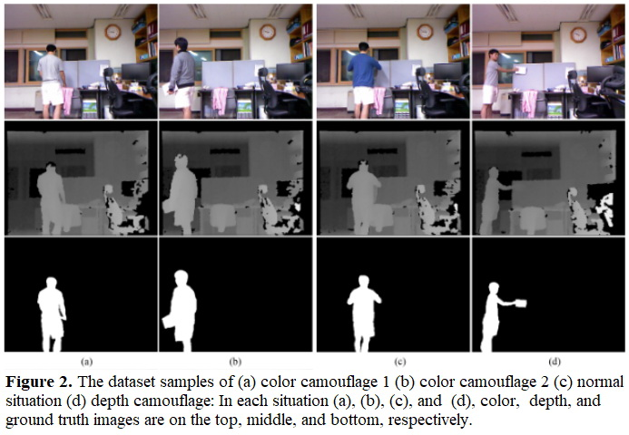

# GMMCD_BGS
An official repository for "Background subtraction based on Gaussian mixture models using color and depth information".



# Progress
Now I have been converting an original visual C/C++ implementation into Python classes.


# Dataset




## References

[1] Young-min Song, SeungJong Noh, Jongmin Yu, Cheon-wi Park, Byung-geun Lee, "Background subtraction based on Gaussian mixture models using color and depth information," In The 2014 international conference on control, automation and information sciences (ICCAIS 2014), IEEE, pp. 132-135, Dec. 2014. [[link]](https://doi.org/10.1109/ICCAIS.2014.7020544)

[2] Zoran Zivkovic and Ferdinandvan der Heijdenb, "Efficient adaptive Density estimation per image pixel for the task of background subtraction," In Pattern Recognition Letters, vol. 27, no. 7, pp. 773--780, May 2006. [[link]](https://doi.org/10.1016/j.patrec.2005.11.005)

## Citation [[link]](https://doi.org/10.1109/ICCAIS.2014.7020544)

```
\bibitem{gmmcd} Young-min Song, SeungJong Noh, Jongmin Yu, Cheon-wi Park, Byung-geun Lee, 
``Background Subtraction Based on Gaussian Mixture Models using Color and Depth Information,'' 
In The 2014 international conference on control, automation and information sciences (ICCAIS 2014), IEEE, pp. 132-135, Dec. 2014.
```

## [License](https://github.com/SonginCV/GMMCD_BGS/blob/master/LICENSE)
BSD 2-Clause "Simplified" License.
